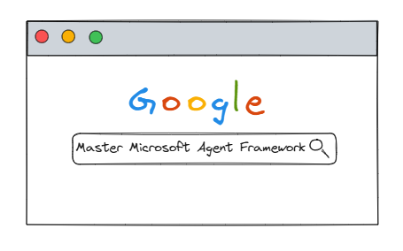

# Mastering Microsoft Agent Framework 🚀

This repository contains **hands-on projects exploring different aspects of agentic AI** using Microsoft Agent Framework — from simple agents to multi-agent orchestration and coordination.

## 📂 Structure

- `/01-basic-agent/` …

## 🎯 Goals

- Understand how agent frameworks are designed  
- Build and test custom agent components  
- Experiment with coordination, memory, and planning mechanisms  

## ⚙️ Tech Stack

- **C#**  
- **Microsoft Agent Framework**  

## 📖 Notes

This repo evolves as I learn — expect **messy experiments, refactors, and breakthroughs**. Practical examples are included wherever appropriate.
